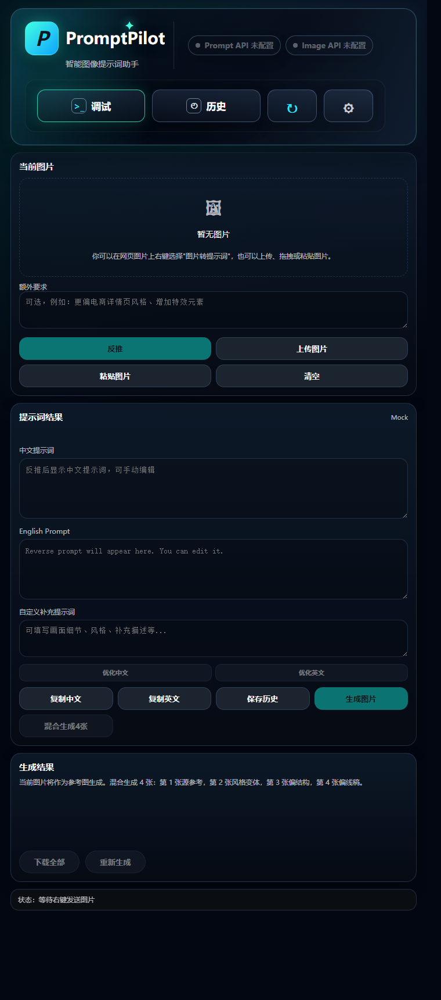

# PromptLens

<p align="center">
  
</p>

PromptLens 是一个 Chrome / Edge Manifest V3 浏览器插件，用来把网页图片变成可编辑、可复用、可继续出图的 AI 绘图 Prompt。

它适合这样的工作流：看到一张图，右键发送到侧边栏，反推中文/英文提示词，继续优化，直接生成新图，必要时再生成多角度参考图。像给浏览器装了一枚小镜头，看到灵感就能顺手拆解。

[GitHub 仓库](https://github.com/IGuanggg/PromptLens)

## 现在的重点

PromptLens 不是一个只会“识图写一句话”的小工具。它更像一个轻量的图片创作工作台：

- 图片输入：支持右键网页图片、上传图片、粘贴图片、拖拽图片。
- Prompt 反推：输出中文 Prompt、英文 Prompt 和 tags，支持额外要求与自定义补充提示词。
- Prompt 优化：中文/英文 Prompt 可继续二次优化。
- 图片生成：基于反推结果调用 Image API 出图。
- 多角度生成：围绕同一主体生成参考角度、侧面、背面、顶面视角。
- 历史管理：保存图片、Prompt、生成结果，支持搜索、恢复、删除、导入、导出。
- 调试日志：记录最近调用、请求尺寸、Provider payload、错误原因，排查接口问题更直接。
- 模型获取：填写 Base URL 和 API Key 后，可尝试读取 `/v1/models`，从列表中选择模型；失败时仍可手动填写。

## 本次更新

### 更清楚的创作工作流

Side Panel 被整理成三个步骤：

1. 图片输入
2. Prompt 编辑
3. 图片生成

每个区域只突出当前最重要的动作。反推、生成图片、多角度生成、历史、调试都还在原来的逻辑里，但界面层级更清楚，第一次使用时不用在一堆按钮里找方向。

### 设置页更像真正的控制台

Options 设置页现在把 Prompt API 和 Image API 分成“基础配置”和“高级配置”：

- 基础配置：接口类型、Base URL、API Key、Model、获取模型、测试按钮。
- 高级配置：Endpoint、Request Template、Response Map、日志控制、Size Format 等。

常用项更靠前，高级项不消失，只是不再一上来把页面撑成一张配置说明书。

### 自动获取模型

Prompt API 和 Image API 都支持模型发现：

- 自动从 Base URL 推导 `/v1/models`。
- 支持 OpenAI-compatible 常见返回结构：`data`、`models`、`result.data`、`response.data`。
- 支持 Bearer、`x-api-key`、query key、自定义 header、无鉴权等方式。
- 发现到的模型只用于选择，最终仍保存到原有的 `promptApi.model` / `imageApi.model` 字段。

如果你的接口不支持 `/v1/models`，不会影响使用。手动填写模型仍然是兜底路径。

### 响应式布局优化

这次重点优化了窗口缩放时的稳定性：

- Side Panel 在 300px、320px、375px、420px、560px、760px 等宽度下更稳。
- Header、状态条、按钮组在窄宽下分层排列，减少挤压和横向滚动。
- Options 页在 375px、620px、820px、1024px、1160px 等宽度下更自然。
- 历史弹窗和调试抽屉的搜索、过滤器、日志行在窄屏下不会硬撑容器。

换句话说，它现在更像一个能住在浏览器侧边栏里的工具，而不是被塞进侧边栏的网页。

## 核心功能

### 图片转 Prompt

- 右键网页图片发送到 PromptLens。
- 支持上传、粘贴、拖拽图片。
- 自动生成中文 Prompt、英文 Prompt 和 tags。
- 支持额外要求，例如“更偏电商详情页”“加强材质”“输出适合角色设定的描述”。

### Prompt 编辑与优化

- 中文/英文 Prompt 都可以手动编辑。
- 支持中文 Prompt 优化和英文 Prompt 优化。
- 支持生成前 Prompt 净化，降低因高风险表达触发接口审核的概率。
- 原始文本框内容不会被净化逻辑直接改写，净化只影响实际请求。

### 图片生成

- 支持 OpenAI-compatible Image API。
- 支持 Custom Image API request template。
- 支持单张下载和批量下载。
- 支持错误卡片展示，生成失败时可以直接复制错误日志或打开调试面板。

### 多角度参考图

多角度生成会围绕同一个主体生成：

- 参考角度
- 侧面视角
- 背面视角
- 顶面视角

适合角色设定、产品参考、素材拆解、建模参考等场景。

### 输出尺寸

清晰度已经升级为 1K / 2K / 4K，并支持 5 种常见比例：

| 预设 | 1:1 | 16:9 | 9:16 | 4:3 | 3:4 |
| --- | --- | --- | --- | --- | --- |
| 1K / 标准 | 1080 x 1080 | 1920 x 1080 | 1080 x 1920 | 1440 x 1080 | 1080 x 1440 |
| 2K / 高清 | 1440 x 1440 | 2560 x 1440 | 1440 x 2560 | 1920 x 1440 | 1440 x 1920 |
| 4K / 超清 | 2160 x 2160 | 3840 x 2160 | 2160 x 3840 | 2880 x 2160 | 2160 x 2880 |

如果当前 Provider 只支持固定尺寸，Adapter 层会映射到兼容尺寸，并在调试日志里记录 `IMAGE_SIZE_MAPPED`。

### 历史与草稿

- 自动保存本地草稿。
- 历史记录支持搜索、筛选、恢复、删除、导入、导出。
- 生成结果可以随历史一起恢复。
- 历史导出不会包含 API Key。

### 调试面板

内置调试抽屉可以查看：

- 最近一次 API 调用
- 请求 / 响应日志
- Provider、Endpoint、HTTP 状态码和耗时
- requestedSize 与 providerSize
- 错误码、错误消息、是否可重试

敏感信息会做脱敏处理，例如 API Key、Authorization header、Base64 图片数据。

## 支持的接口

### Prompt / Vision

- OpenAI-compatible Chat / Vision
- Custom Prompt API
- Mock fallback

### Image Generation

- OpenAI-compatible Image API
- Custom Image API
- Mock fallback

Custom Image API 模板变量支持：

```text
{{model}}
{{prompt}}
{{width}}
{{height}}
{{size}}
{{dashscopeSize}}
{{aspectRatio}}
{{resolutionPreset}}
{{sizeMode}}
```

OpenAI 风格：

```json
{
  "model": "{{model}}",
  "prompt": "{{prompt}}",
  "size": "{{size}}"
}
```

DashScope 风格：

```json
{
  "model": "{{model}}",
  "prompt": "{{prompt}}",
  "size": "{{dashscopeSize}}"
}
```

## 安装方式

1. 下载或克隆仓库。
2. 打开 Chrome 或 Edge。
3. 进入 `chrome://extensions`。
4. 打开“开发者模式”。
5. 点击“加载已解压的扩展程序”。
6. 选择项目中的 `extension/` 目录。
7. 在网页图片上右键，选择“图片转提示词”。

## 基本使用

1. 在网页图片上右键发送到 PromptLens，或手动上传 / 粘贴图片。
2. 在侧边栏确认图片预览。
3. 可选填写“额外要求”。
4. 点击“反推”。
5. 编辑中文 Prompt、英文 Prompt 或 tags。
6. 点击“生成图片”或“生成多角度”。
7. 下载结果，或保存到历史中继续对比。

## 设置建议

### Prompt API

建议使用支持视觉输入的模型。只支持纯文本的模型无法真正理解图片内容。

常用配置：

- Base URL
- API Key
- Model
- Endpoint
- Temperature
- Max Tokens
- 自定义补充提示词

### Image API

常用配置：

- Base URL
- API Key
- Model
- Response Format
- Size Format
- 输出尺寸模式

如果接口支持 `/v1/models`，可以先点“获取模型”。如果不支持，直接手动填写模型名即可。

## 本地存储与隐私

PromptLens 不做账号系统，不做云同步，主要数据保存在本机浏览器里。

主要 storage key：

- `settings`：插件设置
- `pendingImage`：右键图片后的待处理图片
- `promptpilotDraft`：当前工作草稿
- `promptpilotHistory`：历史记录
- `promptpilotLogs`：调试日志

这些旧 key 会继续保留，用来兼容 PromptPilot 时期的用户数据，避免升级后丢配置、丢草稿、丢历史。

## 开发与验证

项目使用原生 HTML / CSS / JavaScript，不依赖 React、Vite 或 Webpack。

发布前建议运行：

```bash
node scripts/verify.mjs
git diff --check
```

`scripts/verify.mjs` 会检查：

- JavaScript 语法
- manifest JSON
- 输出尺寸预设
- OpenAI-compatible 尺寸映射
- Custom Image API 模板变量和鉴权
- Image API 测试路由
- 模型发现 URL 和响应解析
- Options / Side Panel DOM id 与 JS 绑定
- HTML 常见损坏标记

## 项目结构

```text
PromptLens/
├─ docs/
├─ extension/
│  ├─ manifest.json
│  ├─ assets/
│  └─ src/
│     ├─ adapters/
│     ├─ data/
│     ├─ options/
│     ├─ services/
│     ├─ sidepanel/
│     ├─ storage/
│     └─ utils/
├─ scripts/
├─ AUDIT.md
├─ ARCHITECTURE_REVIEW.md
└─ README.md
```

## 更新日志

### v0.5.0 - 模型获取、工作流 UI 与响应式布局

- Prompt API / Image API 新增“获取模型”能力，可从 Base URL 自动推导 `/v1/models`。
- 模型发现支持多种 OpenAI-compatible 返回结构，失败时不阻塞手动填写。
- Options 页重排为基础配置和高级配置，减少配置噪音。
- Side Panel 重排为图片输入、Prompt 编辑、图片生成三个步骤。
- Header 状态条更紧凑，Prompt API / Image API / 最近调用状态更清楚。
- 响应式布局增强，侧边栏窄宽、普通宽度、宽屏下都更稳定。
- 历史弹窗、调试抽屉、按钮组、模型选择区域优化窄屏表现。
- 发布校验脚本增加模型发现、DOM 绑定、HTML 损坏标记等检查。
- `.claude/` 加入忽略列表，避免本地 Claude 环境文件进入仓库。

### v0.4.2 - 发布验证脚本与请求构造解耦

- 新增 `scripts/verify.mjs`，统一检查语法、manifest、尺寸矩阵、Provider payload、认证方式、DOM id 和 HTML 状态。
- Custom Image API 测试与正式生成复用同一套 request builder，减少测试路径和正式路径不一致的风险。
- 新增 `ARCHITECTURE_REVIEW.md`，记录模块分层、生成数据流、Provider 路由和后续拆分建议。

### v0.4.1 - 设置页稳定性与 Image API 测试修复

- 修复 Options 页面尺寸控件初始化问题，避免脚本中断导致 tabs、保存设置、测试按钮不可点击。
- 测试 Image API 时按 Provider 类型正确路由。
- Custom Image API 测试支持 `{{width}}`、`{{height}}`、`{{size}}`、`{{dashscopeSize}}` 等模板变量。
- 保留 `IMAGE_PAYLOAD_SIZE` / `IMAGE_SIZE_MAPPED` 日志，方便确认 requestedSize 与 providerSize。

### v0.4.0 - API v2、图片持久化与超时优化

- 适配新版图像生成接口和结果轮询方式。
- 增加 IndexedDB 图片 Blob 存储、缩略图生成、历史图片迁移和孤儿 Blob 清理。
- 优化提交请求和轮询请求超时，适配更慢的真实出图任务。

### v0.3.x - 项目更名为 PromptLens

- 插件显示名、侧边栏标题、设置页标题、文档和仓库名统一为 PromptLens。
- 保留旧 storage key，兼容 PromptPilot 时期的用户数据。
- 增加右键发送通知、粘贴诊断、图片持久化能力。

### v0.2.0 - 双通道生成与模型能力系统

- 增加 Image / Nano Banana 双通道图像生成架构。
- 设置页增加模型能力卡片。
- 增加 Prompt 净化开关，降低高风险表达导致的生成失败概率。

### v0.1.x - MVP 与尺寸系统升级

- 完成右键图片到 Side Panel、Prompt 反推、图片生成、多角度生成、历史记录、调试日志的基础闭环。
- 输出尺寸从 720p / 1080p 升级为 1K / 2K / 4K。
- 多角度生成统一使用 `getOutputSize()`，避免固定回退到 1:1。

## 许可

当前仓库未声明开源许可证。使用、分发或二次开发前，请先确认作者授权。
